# 🧭 CollabCanvas – System Architecture Diagram

This document describes the system architecture for the **CollabCanvas MVP**, based on the finalized PRD and technical implementation plan.

It illustrates:
- The **frontend React components and hooks** structure
- The **real-time synchronization flow** between client and Firebase
- The **backend collections** used for collaboration (objects, cursors, presence)
- The **deployment infrastructure** (Vercel + Firebase)

---

## **System Overview**

- **Frontend:** React + Vite + React Context + Konva.js  
- **Backend:** Firebase Authentication + Firestore (Serverless)  
- **Hosting:** Vercel (for frontend), Firebase SDK (for APIs)  
- **Realtime Features:** Presence, Cursors, Shared Canvas Objects

---

## **Architecture Diagram (Mermaid)**

```mermaid
graph TD

%% =====================
%% CLIENT LAYER
%% =====================
subgraph CLIENT [Frontend: React + Vite]
    A1[App.tsx<br/>Root Component]
    A2[Canvas.tsx<br/>Konva Renderer]
    A3[PresenceBox.tsx<br/>Active Users UI]
    A4[CursorLayer.tsx<br/>Realtime Cursors]
    A5[Login.tsx<br/>Google OAuth UI]
    A6[useAuth Hook<br/>Firebase Auth]
    A7[useCanvasObjects Hook<br/>Sync Canvas Objects]
    A8[usePresence Hook<br/>Presence Listener]
    A9[useCursor Hook<br/>Cursor Broadcasting]
    A10[React Context<br/>Shared State]
end

%% =====================
%% BACKEND LAYER
%% =====================
subgraph BACKEND [Firebase: Serverless Backend]
    B1[Firebase Authentication<br/>Google Provider]
    B2[Firestore Collection:<br/>canvasObjects]
    B3[Firestore Collection:<br/>presence]
    B4[Firestore Collection:<br/>cursors]
end

%% =====================
%% INFRASTRUCTURE LAYER
%% =====================
subgraph INFRA [Deployment & Hosting]
    C1[Vercel Hosting<br/>Frontend Build]
    C2[Firebase SDK / API Access]
end

%% =====================
%% CONNECTIONS
%% =====================

%% Frontend Hierarchy
A1 --> A2
A1 --> A3
A1 --> A4
A1 --> A5

%% Hooks and Components
A5 --> A6
A2 --> A7
A3 --> A8
A4 --> A9

%% Shared State
A6 --> A10
A7 --> A10
A8 --> A10
A9 --> A10

%% Backend Sync
A6 -->|Sign In/Out| B1
A7 -->|Sync Objects| B2
A8 -->|Update Presence| B3
A9 -->|Push Cursor Data| B4

%% Infra Integration
A1 -->|Deployed via| C1
C1 -->|Uses| C2
C2 -->|Accesses| B1
C2 -->|Accesses| B2
C2 -->|Accesses| B3
C2 -->|Accesses| B4

%% =====================
%% NOTES (Separate and Valid)
%% =====================

%% Canvas Objects Logic
A7 --- N1
N1:::noteNode
N1["📘 Firestore listener pushes updates to React Context.<br/>Full-document writes with ~100ms debounce; 'last-write-wins' via serverTimestamp()."]

%% Presence Logic
A8 --- N2
N2:::noteNode
N2["👥 Presence stored in `/presence` with `expiresAt`.<br/>TTL removes stale users after ~5 minutes."]

%% Cursor Logic
A9 --- N3
N3:::noteNode
N3["🖱️ Cursor data throttled (~100 ms).<br/>One document per user in `/cursors`; uses presence color."]

classDef noteNode fill:#f0f9ff,stroke:#a3c4f3,stroke-width:1px,rx:5,ry:5,color:#000;
```

---

## **Key Takeaways**

1. **React Components & Hooks**
   - `Canvas.tsx` manages drawing and user interaction via Konva.
   - `useCanvasObjects` syncs real-time canvas data with Firestore.
   - `usePresence` and `useCursor` provide real-time collaboration visibility.

2. **Firebase Integration**
   - Authentication: Google OAuth via Firebase Auth.
   - Real-time Database: Firestore used for live sync and presence.
   - No backend servers required (fully client-driven logic).
   - Unauthenticated users are blocked from accessing the canvas.

3. **Deployment Flow**
   - Vercel hosts the static React build.
   - Firebase SDK manages all API and data interactions.
   - Deployed app communicates directly with Firebase collections for real-time updates.
   - Performance guardrail: soft cap ~300 shapes for MVP to sustain 60 FPS.

---

This architecture represents the **MVP foundation** of CollabCanvas — focusing on multiplayer collaboration, transient authentication, and efficient real-time synchronization.
