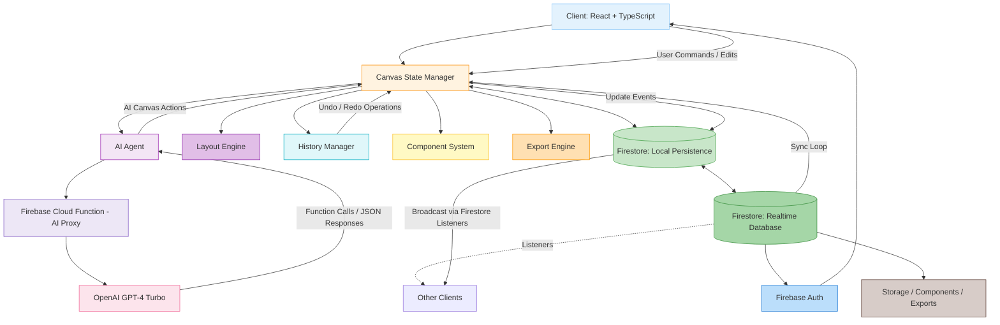

# 🧩 CollabCanvas – System Architecture (v3)

This document describes the updated system architecture for **CollabCanvas AI Edition (Phase 2)**, aligned with PRD v3.1 and task_v2.md.

---

---

## 🧠 **Subsystem Overview**

### 🖥️ **Client Layer**
- **React + TypeScript frontend** powers canvas rendering, shape manipulation, and real-time collaboration.
- Core modules include:
  - `Canvas State Manager`: orchestrates local updates and Firestore sync.
  - `AI Agent`: translates user text commands into canvas API actions.
  - `Layout Engine`: handles constraint-based auto-layout and bounding box logic.
  - `History Manager`: tracks both AI and manual actions for undo/redo.
  - `Component System`: manages reusable grouped elements.
  - `Export Engine`: enables export to PNG/SVG formats.

---

### ☁️ **Sync & Persistence Layer**
- **Firestore Realtime Database** provides low-latency sync for all objects, cursors, and edits.
- Employs **Last-Write-Wins (LWW)** conflict resolution globally.
- Maintains full local persistence for offline operations.
- Broadcasts updates via Firestore listeners to all active clients.

---

### 🗂️ **Projects & Collections**
- Introduce `projects/{projectId}` as the top-level container for multi-room support.
- Collections per project:
  - `projects/{projectId}/canvasObjects/{objectId}`
  - `projects/{projectId}/presence/{userId}`
  - `projects/{projectId}/cursors/{userId}`
  - `projects/{projectId}/components/{userId}/{componentId}`
- Use `collectionGroup` queries for performance-sensitive reads across projects when needed (dev tools only).

---

### 🖱️ **Cursor Sync Strategy**
- Local interpolation at ~60 FPS (≈16 ms) for smooth visuals.
- Network throttling of cursor writes to Firestore at ~25–50 ms to control cost and load.

---

### 🤖 **AI Layer**
- **Firebase Cloud Function** serves as a secure proxy for OpenAI requests.
- All AI actions are routed through `agent.ts` → `firebaseFunction` → `gpt-4-turbo-2024-04-09`.
- Function-calling schema executes structured canvas actions such as `createShape`, `moveShape`, and `arrangeLayout`.
- AI responses appear as **chat bubbles**, and raw prompt + JSON logs are stored for replay.

---

### 🔄 **Undo / Redo & History**
- **History Manager** records all AI and manual operations.
- History is stored **per user** and mirrored in Firestore for cross-device consistency.
- One AI command equals **one undo step**.
- Supports grouped rollbacks (multi-step actions like AI layout creation).

---

### 🧩 **Auto-Layout & Components**
- **Layout Engine** provides constraint-based automatic alignment and spacing.
- **Component System** enables creation of reusable objects synchronized across canvases.
- Stored in Firestore under `/components/{userId}` and auto-synced in real time.
- Bounding box behavior: **clip** objects at canvas edges (no reflow/shrink).

---

### 📦 **Export & Storage**
- Exports canvas or selection to **PNG** and **SVG**.
- Manages exports and component assets in Firebase Storage.
- Integrates with Firestore for metadata and access control.

---

### 🔐 **Authentication & Security**
- Managed via **Firebase Auth** (email + OAuth providers).
- Protects user and project data with scoped Firestore rules.
- Cloud Functions validate and log AI requests securely (no exposed API keys).

---

### ⚙️ **Deployment & Infrastructure**
- **Frontend:** Vercel static build via Vite.
- **Backend:** Firebase (Firestore, Auth, Cloud Functions).
- **AI Integration:** OpenAI GPT-4-Turbo through Firebase proxy.
- Manual E2E testing performed pre-deployment.

#### Cloud Functions & Secrets (Best Practices)
- Firebase Functions: Node 20, TypeScript (ESM), region `us-central1`.
- Store `OPENAI_API_KEY` as a **Functions secret** (not in client or Vercel envs).
- Restrict proxy CORS to your Vercel domains.

---

**Version:** Architecture v3.0  
**Author:** Tony Kim  
**Last Updated:** October 2025
